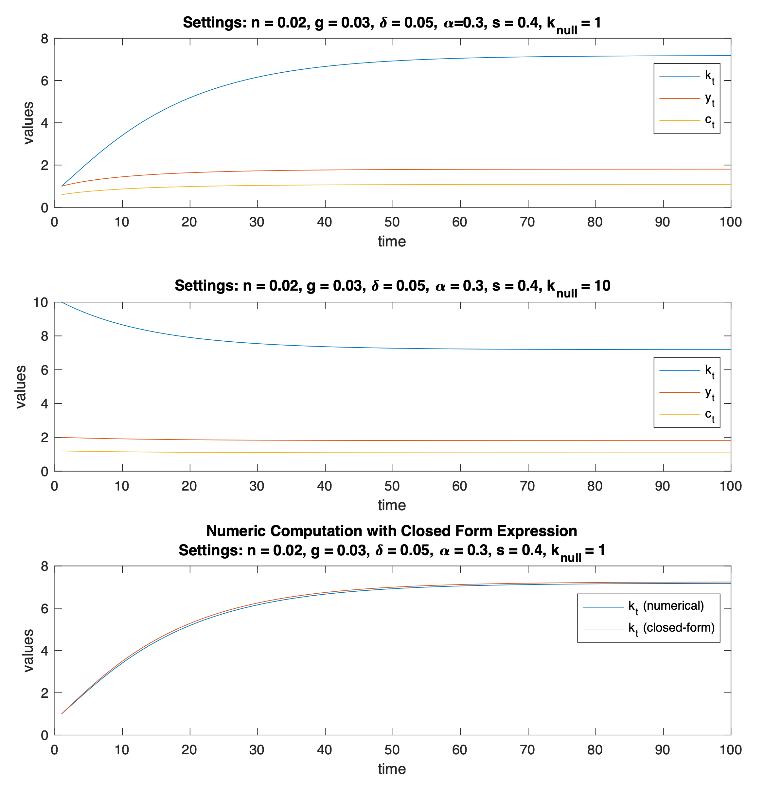
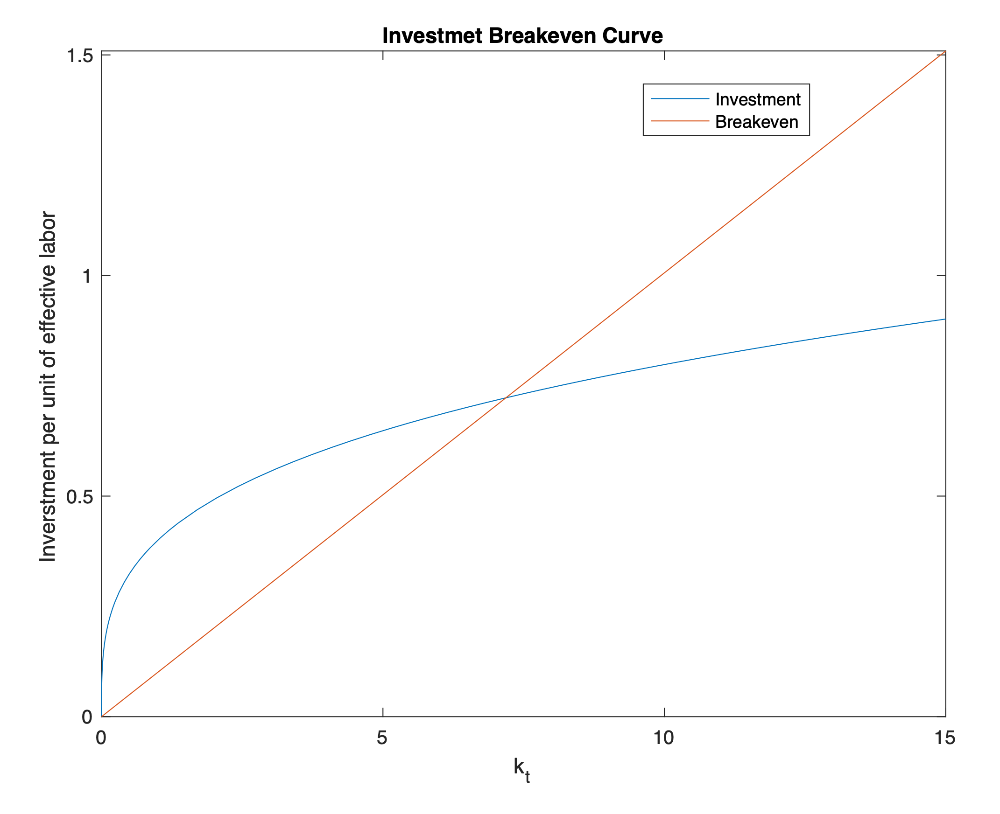
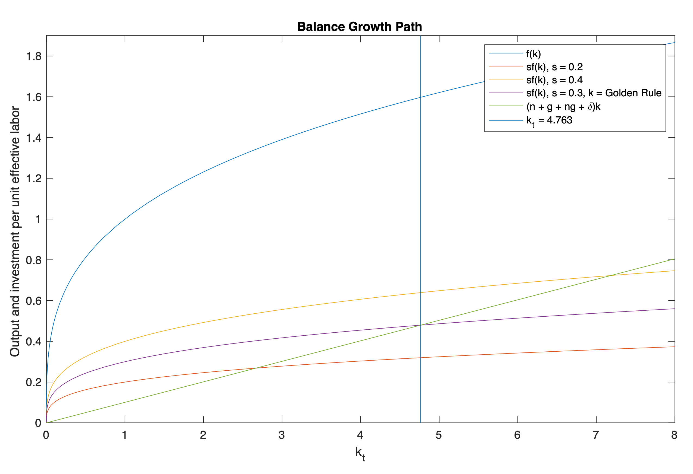
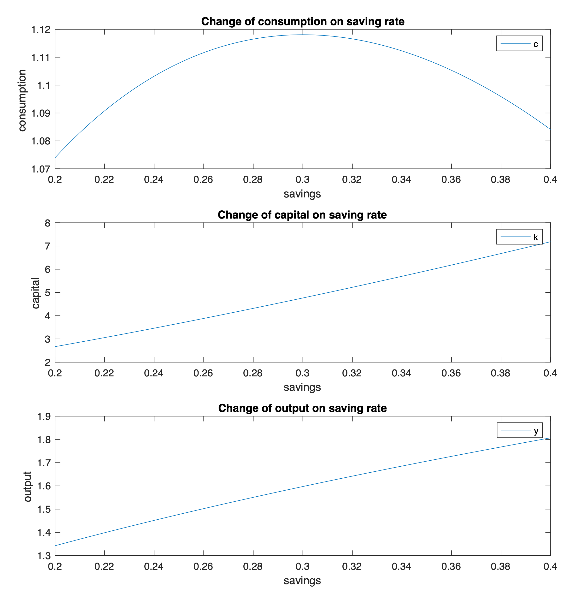

# Solow Growth Model

1. The dynamics: path for `capital`(k), `output`(y), and `consumption`(c) under different parameter settings

	

	
2. Investment breakeven

	

	
3. The balanced growth path

	

4. Change of `consumption`, `capital`, and `output` on `saving rate` (s)

	

